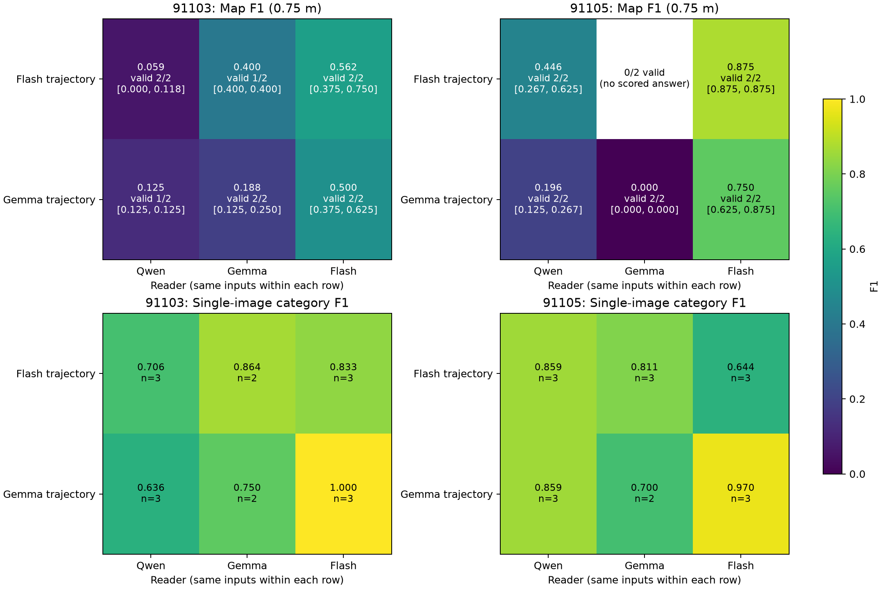
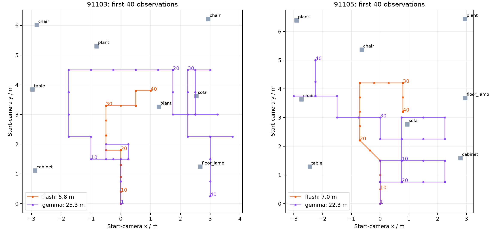
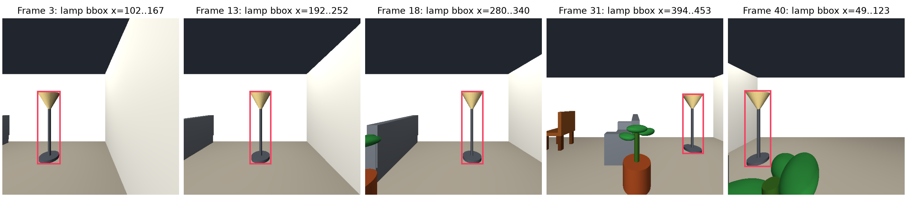

# 探索策略还是感知：两场景交叉验证

状态：已结束；主实验 {'COMPLETE': 52, 'FAILED': 8}，另有 2 次关闭思考补测。

**当前证据更支持：差距主要出现在跨视角空间整合、坐标处理和回答稳定性；探索轨迹也有影响。不能把原来的悬殊差距只解释为探索没找到物体，或只解释为单图识别差。** 这里的“更支持”是对两个典型场景的诊断，不是总体因果贡献率。

## 如何控制变量

选择 91103、91105。每个场景取 Flash、Gemma 自主探索的前 40 帧，各形成一个冻结观察包。Qwen、Gemma、Flash 分别读取完全相同的图像和公开动作，每个组合独立重复两次，共 24 次建图。另固定每个观察包第 1、20、40 帧，做 36 次单图类别与边框识别。全部主实验允许思考。

模型请求中不含轨迹提供者身份、原模型答案或笔记、GT、分割图、真实位姿或分数。无工具、文件读取回调和评测反馈。60 次请求的消息逐字节与公开材料重建校验；评分代码单独读取私有参考。Flash 建图因非流式请求等待异常改为原生 SSE，生成设置和实际消息保持相同，旧请求及取消记录完整保留。

## 同样的证据，换模型；同样的模型，换轨迹

下面是两次重复的物体位置 F1（同类别、一对一匹配、误差 ≤0.75 m）。

| 场景 | 轨迹提供者 | Qwen 两次 | Gemma 两次 | Flash 两次 |
|---|---|---|---|---|
| 91103 | flash | 0.118 / 0.000 | 0.400 / 0.000† | 0.375 / 0.750 |
| 91103 | gemma | 截断 / 0.125 | 0.125 / 0.250 | 0.375 / 0.625 |
| 91105 | flash | 0.625 / 0.267 | 0.133† / 0.000† | 0.875 / 0.875 |
| 91105 | gemma | 0.125 / 0.267 | 0.000 / 0.000 | 0.625 / 0.875 |

† Gemma 的这些完整答案把 frame 字段写成 `[0,0]`，没有通过严格格式校验。表中带 † 数值仅表示“假定其数字坐标按任务要求解释”时的敏感性分析，严格状态仍是失败。截断则没有最终答案，不记作位置 F1=0。原始严格结果见 RESULTS.md。

1. **两种轨迹都提供了目标证据。** 四个观察包均拍到全部 8 个目标。Flash 读取 Gemma 的轨迹，在 91103 的均值为 0.500，在 91105 为 0.750；因此这些轨迹不是完全不足以建图。

2. **同一轨迹，读者差距依然存在。** 例如 91105 的 Gemma 轨迹，Gemma 自己两次为 0.000 / 0.000，Flash 则为 0.625 / 0.875。这部分差距发生在收到同样图像与动作之后。

3. **探索策略也影响后续重建。** Flash 自己读取时，换成 Flash 轨迹相较 Gemma 轨迹，91103 均值为 0.562 对 0.500；91105 为 0.875 对 0.750。Qwen 在 91105 读取 Flash 轨迹的均值为 0.446，读取 Gemma 轨迹为 0.196（若有截断，均值只含有效回答）。不能据此认为所有模型、所有场景都会同幅度受益。

## 单张图是否看得懂

以下只比较三个模型都能评分的同一组输入；Qwen 一次根列表/bbox_2d 输出做了无需 GT 的确定性格式转换，原始严格失败状态仍保留。

| 模型 | 严格完成 / 12 | 共同比较输入数 | 类别清单 F1 | 同类别 + 框 IoU≥0.5 F1 |
|---|---|---|---|---|
| qwen | 11/12 | 9 | 0.786 | 0.544 |
| gemma | 9/12 | 9 | 0.785 | 0.618 |
| flash | 12/12 | 9 | 0.881 | 0.796 |

Flash 的单图感知确实更好，尤其是边框定位；但 Qwen/Gemma 并非普遍认不出物体。类别清单接近，而完整地图差距仍大，提示还存在多视角关联、相机运动累积和几何求解问题。两种任务的 F1 不能直接相减来计算“感知贡献占比”。

## 可逐项核查的典型错误

- **视角到世界坐标的符号错误。** `map_bank_01_gemma_r2` 明确写道：相机朝 +x，台灯在画面右侧，因此台灯 y > 相机 y。按任务约定，此时画面右侧对应 −y，应是 y 更小。它还把多帧中横向位置明显变化的灯反复视为“居中”。离线框显示第 3/13/18/31/40 帧的台灯横向范围分别为 102–167、192–252、280–340、394–453、49–123 像素。原文、原图和离线框均已保留。
- **类别正确仍定位失败。** 91103 的 Gemma 轨迹，Gemma 两次建图都能列出完整类别清单，但位置 F1 只有 0.125、0.250。这不能仅用未识别类别解释。
- **思考循环与坐标约定。** Gemma 3/12 次单图调用在思考中耗尽 8,192 token，没有最终答案。选择最先出现的两次失败，原图原提示仅关闭思考，1–3 秒内均有最终输出；但用了约 0–1000 坐标，原始框得分为 0。固定乘以 511/1000 后，两例框 F1@0.5 为 1.000、0.727。单位转换没有拟合 GT；这说明低分中包含坐标协议和生成控制问题。该补测按失败案例选取，不能据此宣称关闭思考总体更好。

## 轨迹与上下文的影响

同样 40 帧，91103 中 Flash 移动约 5.8 m，Gemma 约 25.25 m；空目标画面分别有 4、9 帧。91105 对应移动约 7.0、22.25 m。更大的视角变化可以增加几何基线，也会增加相机运动累积和实例关联难度；不是走得越多就一定更好。

本实验一次提供全部 40 张图，且不能调用计算工具；原自主探索实验有逐步观察、笔记、工具与最近图片上下文管理。这些条件不同。因此，从本实验到原自主探索成绩的变化不能单独归因于“40 图冲散注意力”。后续最有区分力的小补测，是继续固定这两条轨迹，对比逐图结构化记忆与直接多图输入，再单独控制几何计算工具。

## 原料与复盘

- `results.json`：逐调用指标、完成状态、使用量及格式敏感性分析。
- `input_audit.json`：实际请求与冻结公开材料的一致性校验。
- `../results/`、`../flash_stream/`：完整请求、实际返回、原始 SSE 和模型输出。
- `../flash_transport_transition.json`：传输方式修复及旧队列行政取消说明。
- 网站源码已增加 `/cross-validation.html`，可按场景、轨迹、模型和重复切换，查看所有图片/动作/返回并保存本地评价。查询网站状态的接口此次未响应；本次更新绑定源码，尚未确认线上版本。

