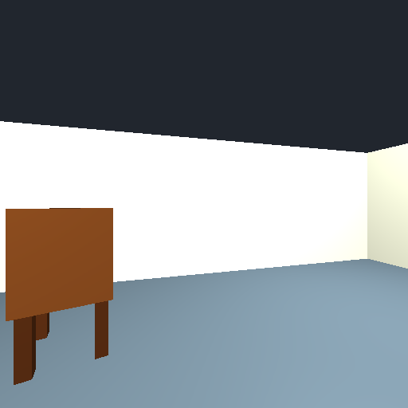
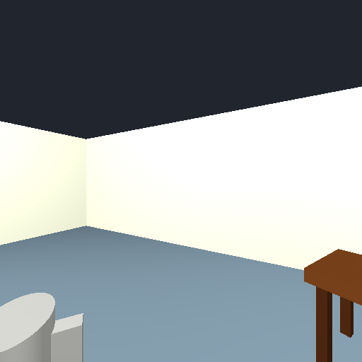
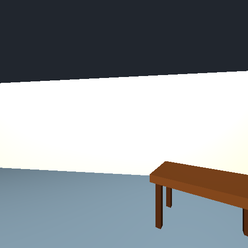

# 聊天协议、实例与证据引用独立复核

范围：封存站点数据中的128个世界 × 2种评估模式 × base/SFT，共512 runs、3229 calls。未发起新模型调用或训练。Reader的128组首轮系统/用户消息、生成设置、16张图像和公开receipt逐项完全相同（仅服务模型名不同）。E2E两边观察由各自策略选择，不能把模式间差别当严格因果实验。

## 最值得保留的结论

1. **SFT明显学会了完成任务和遵循输出协议，但仍不会稳定修复工具约束错误。** Base共有60/256 runs失败，其中41次出现finish_reason=length；所有length对应run均失败。SFT 256/256完成、无length。对完整答案剥掉单个Markdown代码围栏后，SFT reader 505/505、E2E 1306/1309可解析为单JSON；base分别229/428和660/987。这个语法统计不同于执行器接受率：base存在被执行器容忍的tool-call包装，SFT也有3条尾部多余字符。

2. **Reader的超点问题比旧报告中的E2E更普遍。** Reader SFT 96/128 runs（75%）收到“Provide 1..24 points”，共有150次；31个连续至少两次、9个耗光三次投影。E2E为63/128、86次、10个连续至少两次、3个耗光三次。9个reader完全没有成功投影的平均F1=0.079，其他119个=0.686；E2E 3个=0.044、其他125个=0.741。这是同一记录里的关联，不能认定修复格式后一定恢复这些分数。

3. **错误反馈后有逐字重复，不只是差一点数对。** Reader 6个世界出现7次“被拒后原样重复答案”，E2E 3个世界出现3次。例w202609246-reader连发25/25/25点，w202609201-reader为28/28/26点。前三次均拒的9个reader中，3个最终reason仍明说使用了ground-plane projection；不能把reason当作已经执行工具的证据。

4. **改善不能全部归因于完成率。** 只看base与SFT均完成的reader 101世界，忽略坐标的类别计数可兼容对象为482→533，实际匹配为164→416；E2E 95世界分别410→515、127→418。w202609274-reader两边类别/数量都完全一样，SFT仍把匹配0/5提高到5/5。类别计数可兼容只是宽松上界，不证明同一实例识别正确。

5. **引用更多，不等于每一帧都支持实例。** Reader每对象平均引用从844/553=1.53增加到3388/727=4.66，E2E从671/476=1.41到3331/765=4.35。全部预测的引用帧编号都真实存在；但只看已匹配GT的SFT对象，仍有reader 13/508对象（12世界、38/2364引用）与E2E 24/577对象（23世界、45/2506引用），引用帧中的GT中心在相机后方>90°。这是保守几何审查线索，不是像素可见性或全量幻觉率；大物体范围、近距离和pose误差会影响判读。已人工看图确认w202609248-reader的chair引用第7、8帧错误，尽管该run地图F1=1。

6. **类别错误与重复实例仍有明确残留。** Reader SFT 727个输出中52个类别不存在于该世界GT，涉及44/128世界；E2E 765个中58个、涉及50/128世界。相对输出数量的比例比base低（reader10.3%→7.2%，E2E9.9%→7.6%），因此不能只用错误总数说SFT更差。这些是类别不相符，可能源于误分类，并非均为凭空捏造对象。重复GT类别的计数缺口reader56→43、E2E80→41，改善但未消失。

## 六个可直接复查的案例

### w202609274 · reader · 重复实例保留和定位的真实正例

F1：0.0000 → 1.0000。[双栏聊天与地图](https://epsilondylan.github.io/spatial-mapping-review/sft-compare.html#case=w202609274&mode=reader&view=chat)。

两边都输出3把凳子、1把椅子、1株植物，类别和数量已经相同；SFT把匹配数从0提高到5。SFT投影17点成功，30点遭拒后缩到23点成功。表明收益包含有效坐标改进，不能全部归因于完成率或格式。

- `sft / readout_03_0`（call零基索引3）原文：`Identified all 5 distinct objects in the room (one chair, three stools, and one plant)`
- `sft / readout_03_0`（call零基索引3）原文：`"id":"stool_2","category":"stool","x":-5.53,"y":0.14`

### w202609248 · reader · 满分地图仍会引用错误帧

F1：0.0000 → 1.0000。[双栏聊天与地图](https://epsilondylan.github.io/spatial-mapping-review/sft-compare.html#case=w202609248&mode=reader&view=chat)。

Base把杯子写成trash_bin且混淆椅子与桌子；SFT正确输出椅子/桌子/杯子且3个都匹配。但chair_1引用7、8、11帧，其中GT椅子中心在相机后方；逐图复核7帧只有杯子/桌子的部分，8帧只有桌子，不能支持椅子证据。高地图F1和引用忠实性应分开评分。

- `base / readout_03_0`（call零基索引3）原文：`"id":"trash_bin_1","category":"trash_bin"`
- `sft / readout_03_0`（call零基索引3）原文：`"id":"chair_1","category":"chair","x":-1.14,"y":1.93,"evidence":[1,7,8,11,12,14,15,16]`

### w202619201 · reader · 最强同图退化：协议恢复失败与坐标崩溃

F1：0.8000 → 0.1818。[双栏聊天与地图](https://epsilondylan.github.io/spatial-mapping-review/sft-compare.html#case=w202619201&mode=reader&view=chat)。

SFT连续37→26→25点全部被拒，仍提交地图；真实2书架/1柜被写成1书架/2柜，table的y也从GT -0.703写到+0.5。Base虽有JSON/坐标系格式拒绝，仍用一次4点投影恢复并匹配4个；SFT仅匹配1个。

- `sft / readout_03_0`（call零基索引3）原文：`Identified all 5 distinct objects in the room (sofa, two cabinets, bookshelf, and table)`
- `sft / readout_03_0`（call零基索引3）原文：`"id":"table_1","category":"table","x":-1.5,"y":0.5`

### w202609201 · reader · 无工具结果却宣称使用投影

F1：0.4000 → 0.0000。[双栏聊天与地图](https://epsilondylan.github.io/spatial-mapping-review/sft-compare.html#case=w202609201&mode=reader&view=chat)。

SFT三次28→28→26点均遭拒，前两次答案完全相同；最终4个类别都在GT中，但全部坐标均未在0.75m内匹配，遗漏printer。cup的y从GT -1.476写成+1.5。最终reason自报使用ground-plane projection，而本次记录中没有成功投影返回。这只证明自报告与工具记录不符，不推断隐藏思维过程。

- `sft / readout_03_0`（call零基索引3）原文：`using multi-view triangulation and ground-plane projection.`
- `sft / readout_03_0`（call零基索引3）原文：`"id":"cup_1","category":"cup","x":3.5,"y":1.5`

### w202609218 · reader · 重复实例增殖、规则坐标与大范围复制引用

F1：0.6154 → 0.4286。[双栏聊天与地图](https://epsilondylan.github.io/spatial-mapping-review/sft-compare.html#case=w202609218&mode=reader&view=chat)。

GT为4张桌、1株植物、1个柜；SFT输出6张桌、1株植物、1个不存在于GT的sofa。table_3到table_6坐标x=-1,-2,-3,-4、y都4.2，且复制同一11帧引用集。readout_00_0还按u=15,25,...245、v=345生成table_f1_right_leg1..24的等距点；之后24点投影成功也没避免实例错误。不能仅凭规则数列称为幻觉，但可作为值得审查的实例锚定弱点。

- `sft / readout_03_0`（call零基索引3）原文：`Identified 6 tables, 1 plant, and 1 sofa across the 360-degree panoramic observations.`
- `sft / readout_03_0`（call零基索引3）原文：`"id":"table_3","category":"table","x":-1.0,"y":4.2`

### w202609283 · e2e · 类别数量全对但地图分数退化

F1：0.8333 → 0.5714。[双栏聊天与地图](https://epsilondylan.github.io/spatial-mapping-review/sft-compare.html#case=w202609283&mode=e2e&view=chat)。

SFT补回book和trash_bin，7个GT类别各一个全部对上，三次投影18/24/20点均有返回；但cabinet坐标(-0.6,3.42)距GT约2.07m，printer(-0.33,4.56)距GT约1.19m，sofa距GT约0.86m，因此只匹配4/7，F1从0.833降到0.571。定位误差仍是独立瓶颈，不是所有失败都能靠协议修复解决。

- `sft / acquire_06_0`（call零基索引6）原文：`All 7 distinct objects (sofa, floor_lamp, trash_bin, chair, book, printer, cabinet) have been identified, distinguished, and located with sufficient evidence.`
- `sft / readout_03_0`（call零基索引10）原文：`"id":"cabinet_1","category":"cabinet","x":-0.6,"y":3.42`

### 已看图核验的引用失配

w202609248-reader：第1帧左边能看到椅子，第7帧为杯子和桌子的部分，第8帧为桌子。SFT chair_1同时引用这些帧。

## 建议的下一轮验证

- 优先做一个封存输入上的小型对照：强制project_ground分批≤24点，单独量化完成率、定位与实例变化；目前没有执行该实验，不能给出收益承诺。
- 将evidence验证设为独立指标：帧号存在、几何一致、像素确实含该实例，逐层区分。w202609248可作为高F1但引用错的回归案例。
- 把“类别/数量正确但坐标错”（w202609283）与“类别混淆/重复增殖”（w202609218）分开复盘，避免只按总F1选训练样本。
- 将相同错误后完全重复的答案作为恢复能力评测，而不仅统计最终COMPLETE。

## 方法与限制

实际Rejected计数来自下一条同阶段request中的直接反馈，避免把累计聊天历史重复计数；没有后续request的终止错误可能不在该计数里。全部3229条的reasoning字段为空，配置enable_thinking=false；这不等于模型没有内部推理。本文只引用已保存的answer/reason自报告，不补写内部思维。对象匹配、F1和GT来自封存结果；未重新执行模型。案例按机制选择，不能用6个案例估计发生率。旧站已报告E2E 63/128超点拒绝，本报告该点是独立复核；Reader 75%、连续拒绝/原样重试、输入逐项相同、证据筛查和这6个world细读为新增。

机器可读细节含每个run/call统计、hash、拒绝分布及证据：`conversation.json`。